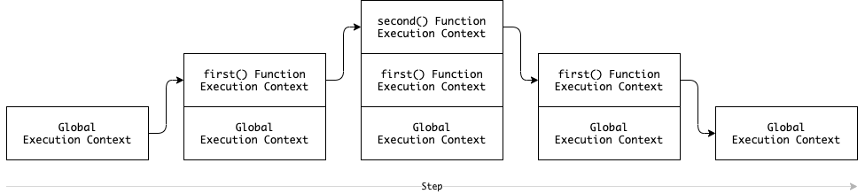
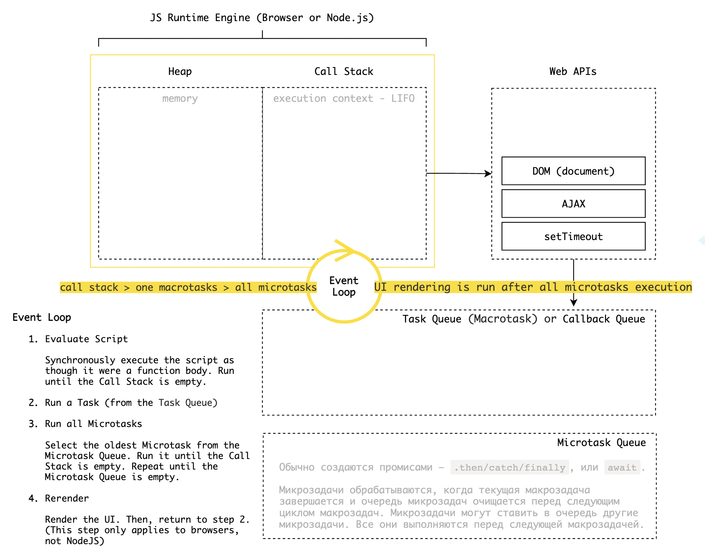

# Вопросы с собесов

Репозиторий содержит популярные вопросы и ответы для подготовки к техсобесам на позицию веб-разработчик.

Каждый желающий может внести свой вклад, участвуя в формировании и актуализации данного репозитория. Буду признателен за выявление ошибок, опечаток и неточностей в трактовании — присылайте пулреквесты.

Цель — сформировать перечень максимально ёмких и корректных ответов на вопросы, выявляющие уровень технических знаний веб-разработчика.

## <a id="top"></a> Содержание

1. [Что такое Singleton?](#1)
1. [Классы и строки являются ссылочным типом?](#2)
1. [Демонизация Node.js](#3)
1. [Чем отличаются коллекции `Set` и `Map`?](#4)
1. [Oбласти видимости у `let` и `const`](#5)
1. [Контекст стрелочной функции](#6)
1. [Особенности Node.js](#7)
1. [Что делает `super` у класса?](#8)
1. [Плюсы Реакта](#9)
1. [Что такое NaN?](#10)
1. [Что такое AJAX?](#11)
1. [ХУКИ](#12)
1. [Жизненный цикл компонента](#13)
1. [CORS](#14)
1. [EVENT LOOP](#15)
1. [Для чего используется `new`?](#16)
1. [Что такое запоминание или мемоизация?](#17)
1. [В чем разница между функцией и функциональным выражением?](#18)
1. [Какие приемы работы с асинхронным кодом в JS Вы знаете?](#19)
1. [Как проверить, является ли значение массивом?](#20)
1. [SPREAD и REST операторы](#21)
1. [Что такое Promise?](#22)
1. [Что такое DNS?](#23)
1. [Что такое MVC?](#24)
1. [Что такое REST API?](#25)
1. [Что такое HTTP?](#26)
1. [Что такое ООП и как оно связано с JS?](#27)
1. [Что такое `strict mode` в JS?](#28)
1. [Что такое Функции высшего порядка?](#29)
1. [Замыкание и его практическая польза?](#30)
1. [MVC фреймворки и библиотеки?](#31)
1. [Контекст выполнения](#32)
1. [Методы `call`, `apply`, `bind`](#33)

<!-- ## <a id="31"></a>
[`↑ scroll up`](#top) -->

## <a id="33"></a> Методы `call`, `apply`, `bind`

Методы `call()` и `apply()` вызывают функцию с указанным контекстом `this` и предоставленными аргументами.

> функция `call()` принимает список аргументов,  
> функция `apply()` — одиночный массив аргументов.

```js
const bill = {
  tip: 0.1,
  calculate(dish1, dish2, sum) {
    return `Ваш обед (${dish1}, ${dish2}) стоит ${sum + sum * this.tip} руб.`;
  },
};

const tips = { tip: 0.2 };

const pay = bill.calculate('pizza', 'salad', 1000); // Ваш обед (pizza, salad) стоит 1100 руб.

const payCount2 = bill.calculate.call(tips, ...['pizza', 'salad', 1000]); // Ваш обед (pizza, salad) стоит 1200 руб.
const payCount1 = bill.calculate.apply(tips, ['pizza', 'salad', 1000]); // Ваш обед (pizza, salad) стоит 1200 руб.
```

`bind()` устанавливает в качестве контекста выполнения `this` предоставленное значение. [[MDN]](https://developer.mozilla.org/ru/docs/Web/JavaScript/Reference/Global_Objects/Function/bind)

```js
const auto = {
  brand: 'BMW',
  drive() {
    return `Заведем наш ${this.brand}`;
  },
};

auto.drive(); // Заведем наш BMW

const autoDrive = auto.drive;
autoDrive(); // Заведем наш undefined.

// В JS значение this определяется тем, каким образом вызвана функция. Cм. как определить значение this — https://habr.com/ru/post/464163/

const motorBike = {
  brand: 'Suzuki',
};

const bikeDrive = auto.drive.bind(motorBike);
bikeDrive(); // Заведем наш Suzuki

const shipDrive = auto.drive.bind({ brand: 'Корабль' });
shipDrive(); // Заведем наш Корабль
```

[`↑ scroll up`](#top) -->

## <a id="32"></a> Контекст выполнения <!-- todo ещё есть eval-контекс, см записи -->

Контекст выполнения (execution context) — это понятие в спецификации языка, описывающее окружение, в котором выполняется JS-код.

Виды контекста в JS:

1. **Глобальный контекст**. Создаётся при запуске скрипта. Предоставляет глобальный объект и ключевое слово `this`. В браузере глобальный объект и `this` являются `window`, в Node.js — `global`.
1. **Контекст выполнения вызова**. Каждый раз, когда вызывается функция, для неё создаётся новый контекст — собственный для каждой функции.



[`↑ scroll up`](#top)

## <a id="31"></a> MVC фреймворки и библиотеки? Зачем они нужны и кто их пишет?

MVC (Model-View-Controller) — это паттерн проектирования модель-представление-контроллер.

Веб-фреймворк — это каркас для написания веб-приложений, который определяет структуру, задаёт правила и предоставляет необходимый набор инструментов для разработки.

Например, для фронта существуют Angular, Vue.js, React (официально библиотека), Svelte. Для бэкенда Django, Laravel, Ruby on Rails, Express, Flask и др.

[`↑ scroll up`](#top)

## <a id="24"></a> Что такое MVC?


MVC — подход к проектированию приложения, который предполагает выделение кода в блоки: модель, представление, контроллер.

- Контроллер обрабатывает входящие запросы.
- Модель достаёт из базы данных информацию, необходимую для выполнения конкретных запросов
- Представление определяет результат запроса, который получает пользователь.

[`↑ scroll up`](#top)

## <a id="30"></a> Замыкание и его практическая польза?

Замыкание — это функция внутри функции, которая имеет доступ к области видимости родительской функции (к её переменным).

> Замыкание — это комбинация функции и лексического окружения, в котором эта функция была определена. Другими словами, замыкание даёт вам доступ к Scope внешней функции из внутренней функции. [[MDN]](https://developer.mozilla.org/ru/docs/Web/JavaScript/Closures)

Функция, определённая в замыкании, запоминает окружение в котором была создана, что позволяет связать данные (лексическое окружение) с функцией, которая работает с этими данными.

Очевидна параллель с ООП, где объекты позволяют нам связать некоторые данные (свойства объекта) с одним или несколькими методами. Следовательно, замыкания можно использовать везде, где вы обычно использовали объект с одним единственным методом.

```js
function createPlayer(name) {
  let score = 0;
  return function scoreCount() {
    score += 1;
    return `${name} – ${score}`;
  };
}

const player1 = createPlayer('Thor');
const player2 = createPlayer('Loki');

player1(); // Thor – 1
player1(); // Thor – 2
player2(); // Loki – 1
```

[`↑ scroll up`](#top)

## <a id="29"></a> Что такое функции высшего порядка?

Это функции, которые либо принимают, либо возвращают другие функции, либо делают всё сразу. Такие функции, как правило, реализуют некий обобщённый алгоритм (например, сортировку).

[`↑ scroll up`](#top)

## <a id="28"></a> Что такое `strict mode` в JS?

Строгий режим (`strict mode`) обеспечивает более тщательную проверку ошибок в коде и упрощает отладку.

Чтобы активировать строгий режим, нужно добавить `'use strict'` первой строкой в начале файла или функции.

[`↑ scroll up`](#top)

## <a id="27"></a> Что такое ООП и как оно связано с JS?

Это одна из парадигм программирования.

В JS реализуется с помощью прототипов или классов, которые в свою очередь образуют иерархию наследования.

Концепции ООП:

- **Инкапсуляция** — позволяет скрыть детали реализации функции, делая код проще в обслуживании и более пригодным для повторного использования.
- **Наследование** (расширение) — позволяет избежать необходимости переписывать один и тот же код и экономит пространство памяти.
- **Полиморфизм** — идея заключается в способности вызвать унаследованную функцию в собственном контексте и получить корректный результат. То есть вызывать ОДИН и тот же код для ВСЕХ допустимых типов (полиморфных) аргументов.

[`↑ scroll up`](#top)

## <a id="26"></a> Что такое HTTP?

Это текстовый протокол, для передачи HTML. Можно скать это набор правил, по которым клиент и веб-сервер обмениваются данными.

```plaintext
// URL

http://example.com:8080/some/path?key1=value1&key2=value2#anchor
└┬─┘   └┬────────┘ └┬─┘ └┬──────┘ └┬────────────────────┘
 │      Host        │    Path      Query string
 Protocol           Port
```

HTTP-request состоит из: стартовой строки, заголовков, тела запроса.

```plaintext
// Стартовая строка

GET /about.html HTTP/1.1
└┬┘ └┬────────┘ └┬─────┘
 │   Path        Protocol version
 Request method
```

```plaintext
// HTTP headers — мета-информация о запросе или ответе

Content-Type: application/json
└┬─────────┘  └┬─────────────┘
 │             Значение
 Имя заголовка
```

```plaintext
// Структура запроса

GET /students HTTP/1.1    ─ Стартовая строка
Host: school.example      ┐
Accept-Language: ru-ru    ├ Заголовки
User-Agent: Mozilla/5.0   ┘
(пустая строка)
(тело запроса — пустое или с данными)
```

```plaintext
// Структура ответа

HTTP/1.1 201 Created
└┬─────┘ └┬┘ └┬────┘
 │        │   Текст кода ответа
 │        Код ответа
 Версия протокола
```

Коды ответа HTTP [[MDN]](https://developer.mozilla.org/ru/docs/Web/HTTP/Status):

| Класс             | Код     | Пример                              |
| :---------------- | :------ | :---------------------------------- |
| Информационные    | 100–199 | смена протокола с HTTP на WebSocket |
| Успешные          | 200–299 |                                     |
| Перенаправления   | 300–399 | сервер просит перейти на другой URL |
| Клиентские ошибки | 400–499 | переданы некорректные данные        |
| Серверные ошибки  | 500–59  | сервер не смог обратиться к БД      |

[`↑ scroll up`](#top)

## <a id="25"></a> Что такое REST API?

REST API — это API, построенные по принципам REST (или RESTful API). Другими словами это архитектурный стиль для операций с сервером, используемый для разработки API, работающих на основе протокола HTTP.

> API (application programming interface) — программный интерфейс приложения.

> REST (representational state transfer) — передача репрезентативного состояния.

В разработке RESTful веб-сервисов нет чётких стандартов, за исключением HTTP, важно спроектировать свой REST API в соответствии с лучшими практиками.

Принципы REST архитектуры:

1. Клиент и сервер — разные части системы.
2. Состояние клиента не хранится на сервере между запросами. В запросе должна храниться вся необходимая информация для обработки запроса.
3. Возможность кэширования ответов сервера
4. Единообразный интерфейс
5. Послойная система (клиенту неважно, общается ли с сервером напрямую)
6. Код по требованию (необязательно; расширяет возможности клиента)

Аналоги:

- GraphQL
- SOAP

[`↑ scroll up`](#top)

## <a id="23"></a> Что такое DNS?

DNS (Domain Name System) — это технология, которая помогает браузеру найти IP-адрес сайта по доменному имени.

[`↑ scroll up`](#top)

## <a id="22"></a> Что такое Promise?

Promise — это объект, представляющий результат асинхронной операции (чтение, запись файла, и т.п.).

Промис показывает статус асинхронной операции (Promise states):

- Pending (ожидание — операция не завершена)
- Resolved / Fulfilled ( выполнено — завершено успешно)
- Rejected (отклонено — завершено с ошибкой)

В качестве аргумента конструктор промиса принимает функцию, у которой два параметра — это колбэки `resolve` и `reject`.

`resolve` возвращает результат выполнения, `reject` — причину невыполнения.

Результат может быть обработан в методе `.then`,
ошибка — в методе `.catch`. Метод `.finally()` принимает callback-функцию, которая сработает при завершении работы промиса, независимо от полученного результата.

```js
const randomPromise = new Promise((resolve, reject) => {
  setTimeout(() => {
    if (Math.random() > 0.5) {
      resolve('Some data…');
    } else {
      reject(new Error('Some message…'));
    }
  }, 2000);
});

randomPromise
  .then((data) => {
    console.log(data);
    console.log('Successfully');
  })
  .catch((err) => {
    console.log(err);
    console.error('Failed');
  });
```

[`↑ scroll up`](#top)

## <a id="21"></a> SPREAD и REST операторы

Разница состоит в том, что с помощью spread мы передаем или распространяем данные массива на другие данные, а с помощью rest — получаем все параметры функции и помещаем их в массив

[`↑ scroll up`](#top)

## <a id="20"></a> Как проверить, является ли значение массивом?

```js
Array.isArray(obj); // true если объект является Array; иначе, false.
```

[`↑ scroll up`](#top)

## <a id="19"></a> Какие приемы работы с асинхронным кодом в JS Вы знаете?

- Функции обратного вызова (Callbacks).
- Промисы (Promises).
- Async/await.

[`↑ scroll up`](#top)

## <a id="18"></a> В чем разница между обычной функцией и функциональным выражением?

Обычная функция всплывает, а функциональное выражение нет

```javascript
// функция
function hoistedFunc() {
  console.log('I am hoisted');
}
// функциональное выражение
var notHoistedFunc = function () {
  console.log('I will not be hoisted!');
};
```

[`↑ scroll up`](#top)

## <a id="17"></a> Что такое запоминание или мемоизация

Мемоизация — это прием создания функции, способной запоминать ранее вычисленные результаты или значения. Преимущество мемоизации заключается в том, что мы избегаем повторного выполнения функции с одинаковыми аргументами. Недостатком является то, что мы вынуждены выделять дополнительную память для сохранения результатов

[`↑ scroll up`](#top)

## <a id="16"></a> Для чего используется `new`?

Ключевое слово `new` используется в функциях-конструкторах для создания нового объекта (нового экземпляра класса).

[`↑ scroll up`](#top)

## <a id="15"></a> EVENT LOOP

Event Loop это цикл, который ожидает задачи, выполняет их и ожидает поступления новых задач.
Асинхронные операции не блокируют поток, они регистрируются и возвращаются в поток после выполнения и очистки стека вызовов(основного потока).



[`↑ scroll up`](#top)

## <a id="14"></a> CORS

Технология браузеров, которая позволяет предоставить веб-страницам доступ к ресурсам другого домена.

[`↑ scroll up`](#top)

## <a id="13"></a> Жизненный цикл компонента

- Mounting - рендер
- Updation - когда меняется стэйт
- Unmounting - рендер другого компонента

[`↑ scroll up`](#top)

## <a id="12"></a> ХУКИ

- useState
- useEffect
- useContext
- useReducer
- useParams
- useHistory
- useRef
- useMemo
- useCalback
- …

[`↑ scroll up`](#top)

## <a id="11"></a> Что такое AJAX?

AJAX или Asyncronous JavaScript and XML — это набор взаимосвязанных технологий, которые позволяют работать с данными в асинхронном режиме. Это означает, что мы можем отправлять данные на сервер и получать данные с него без перезагрузки веб-страницы.

[`↑ scroll up`](#top)

## <a id="10"></a> Что такое `NaN`

`NaN` означает вычислительную ошибку. Это результат некорректной математической операции, например:

```js
alert('не число' / 2 + 5); // NaN
```

Метод `isNaN()`, позволяет проверять является ли значение `NaN`

[`↑ scroll up`](#top)

## <a id="9"></a> Плюсы Реакта

Оптимизирует процесс отрисовки интерфейсов

[`↑ scroll up`](#top)

## <a id="8"></a> Что делает `super` у класса?

Устанавливает свойства наследования за счет вызова родительского конструктора. Метод `super` должен стоять первой строкой в методе `constructor`.

При переопределении конструктора:

- Обязателен вызов конструктора родителя `super()` в конструкторе наследника до обращения к `this`.

При переопределении другого метода:

- Мы можем вызвать `super.method()` в методе наследника для обращения к методу родителя.

```js
// Родительский класс (суперкласс)
class Point {
  constructor(x, y) {
    // Инициализация объекта
    this.x = x;
    this.y = y;
  }

  getXY() {
    return `x: ${this.x},  y: ${this.y}`;
  }
}

const a = new Point(6, 10);

a.getXY(); // x: 6, y: 10
```

```js
// Класс-наследник (субкласс, подкласс)
class Point3d extends Point {
  constructor(x, y, z) {
    // Вызов конструктора суперкласса
    super(x, y);
    // Продолжение инициализации объекта
    this.z = z;
  }

  getXYZ() {
    return `${super.getXY()}, z: ${this.z}`;
  }
}

const b = new Point3d(0, 0, 20);

b.getXY(); // x: 0, y: 0
b.getXYZ(); // x: 0,  y: 0, z: 20
```

[`↑ scroll up`](#top)

## <a id="7"></a> Особенности Node.js

Node.js — это среда выполнения JS (V8 и ряд механизмов, позволяющих выполнять js-код вне браузера).

- позволяет с помощью JS, взаимодействовать с файловой системой, системой ввода/вывода и другими сущностями, которые недоступны из браузера;
- поддержка модульности;
- возможность не только слать запросы, но и получать и обрабатывать;
- менеджер зависимостей (npm);

[`↑ scroll up`](#top)

## <a id="1"></a> Что такое Singleton

Паттерн программирования, должен гарантированно иметь лишь один объект, и к этому объекту должен быть предоставлен глобальный доступ.

[`↑ scroll up`](#top)

## <a id="2"></a> Классы и строки являются ссылочным типом?

Классы - да, строки нет.

Строки примитивный тип данных, в них ссылок нет, а вот объекты - это ссылочный тип.

[`↑ scroll up`](#top)

## <a id="3"></a> Демонизация Node.js

nodemon, supervisor, …

[`↑ scroll up`](#top)

## <a id="4"></a> Чем отличаются коллекции **Set** и **Map**

У `Set` уникальные значения, у `Map` ключ-значение.

[`↑ scroll up`](#top)

## <a id="5"></a> Oбласти видимости у `let` и `const`

ОВ переменных:

- `let`, `const` – блочная { … }. Видны только после объявления. При использовании в цикле, для каждой итерации создаётся своя переменная.
- `var` – глобальная. Доступ из любого места в коде. Переменная var – одна на все итерации цикла и видна даже после цикла:

```javascript
// С var прокатит:
console.log(hello); // undefined
var hello = 'Hello';

// C let и const — нет:
console.log(hello); // Reference error
let hello = 'Hello';

console.log(bye); // Reference error
const bye = 'Bye';
```

[`↑ scroll up`](#top)

## <a id="6"></a> Контекст стрелочной функции

Стрелочные функции не имеют собственного контекста выполнения. На практике это означает, что они наследуют сущности `this` и `arguments` от родительской функции.

[`↑ scroll up`](#top)
